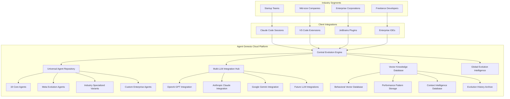

# 🌐 Agent Genesis Cloud: Universal AI Evolution Platform

## 🚀 **The Vision: Revolutionary AI Development Infrastructure**

You've envisioned the **next generation of AI-powered software development** - a centralized evolution platform that transforms how the entire industry builds software. This is **Agent Genesis Cloud**: the universal AI evolution middleware.

## 🎯 **What Agent Genesis Cloud Provides**

### **🏗️ Industry-Scale Architecture**



## 🧠 **Central Evolution Intelligence System**

### **Master AI Evolution Controller**

```typescript
// Agent Genesis Cloud - Central Evolution Brain
class CentralEvolutionIntelligence {
  async orchestrateGlobalEvolution(): Promise<GlobalEvolutionResult> {
    // Phase 1: Collect data from ALL Claude Code sessions globally
    const globalSessionData = await this.collectGlobalSessionData();

    // Phase 2: Analyze patterns across entire industry
    const industryPatterns =
      await this.analyzeIndustryWidePatterns(globalSessionData);

    // Phase 3: Generate evolution strategies for different contexts
    const evolutionStrategies =
      await this.generateContextualEvolutionStrategies(industryPatterns);

    // Phase 4: Deploy evolved agents to all connected sessions
    const deploymentResults =
      await this.deployEvolvedAgentsGlobally(evolutionStrategies);

    // Phase 5: Monitor global performance impact
    const globalImpact =
      await this.measureGlobalPerformanceImpact(deploymentResults);

    return {
      evolvedAgents: deploymentResults.newAgentVersions,
      globalImpact,
      nextEvolutionCycle: await this.planNextGlobalEvolution(),
    };
  }

  // Collect behavioral data from thousands of Claude Code sessions
  async collectGlobalSessionData(): Promise<GlobalSessionData> {
    const connectedSessions = await this.getAllConnectedSessions();
    const globalData = {
      sessionCount: connectedSessions.length,
      totalInteractions: 0,
      behavioralPatterns: {},
      performanceMetrics: {},
      contextDistribution: {},
      evolutionOutcomes: {},
    };

    // Collect data from each session (privacy-preserved)
    for (const session of connectedSessions) {
      const sessionData = await this.collectSessionData(session.id);

      // Aggregate behavioral patterns
      this.aggregateBehavioralPatterns(
        globalData.behavioralPatterns,
        sessionData.behaviors
      );

      // Aggregate performance metrics
      this.aggregatePerformanceMetrics(
        globalData.performanceMetrics,
        sessionData.performance
      );

      // Aggregate context patterns
      this.aggregateContextPatterns(
        globalData.contextDistribution,
        sessionData.contexts
      );

      // Aggregate evolution outcomes
      this.aggregateEvolutionOutcomes(
        globalData.evolutionOutcomes,
        sessionData.evolutions
      );

      globalData.totalInteractions += sessionData.interactionCount;
    }

    return globalData;
  }

  // Analyze patterns across the entire software development industry
  async analyzeIndustryWidePatterns(
    globalData: GlobalSessionData
  ): Promise<IndustryPatterns> {
    return {
      // Most successful agent configurations across all companies
      topPerformingAgentConfigs:
        await this.identifyTopPerformingConfigs(globalData),

      // Context-specific success patterns by industry
      industrySpecificPatterns:
        await this.analyzeIndustrySpecificPatterns(globalData),

      // Emerging trends in software development
      emergingTrends: await this.detectEmergingTrends(globalData),

      // Common failure patterns to avoid
      commonFailurePatterns: await this.identifyCommonFailures(globalData),

      // Cross-company learning opportunities
      crossCompanyLearnings:
        await this.identifyCrossCompanyLearnings(globalData),
    };
  }
}
```

### **Universal Agent Repository**

```typescript
// Central repository of all possible agents and variants
class UniversalAgentRepository {
  private agentCategories = {
    coreAgents: new Map(), // 19 fundamental agents
    metaAgents: new Map(), // 5 evolution agents
    industryVariants: new Map(), // Industry-specialized versions
    enterpriseCustom: new Map(), // Enterprise-specific agents
    experimentalAgents: new Map(), // AI-generated new agents
    communityAgents: new Map(), // Community-contributed agents
  };

  async generateIndustrySpecializedVariants(): Promise<AgentVariant[]> {
    const baseAgents = this.agentCategories.coreAgents;
    const industryVariants = [];

    // Generate variants for different industries
    const industries = [
      "fintech",
      "healthcare",
      "ecommerce",
      "gaming",
      "enterprise",
      "startup",
    ];

    for (const industry of industries) {
      const industryData = await this.getIndustryPatterns(industry);

      for (const [agentId, baseAgent] of baseAgents) {
        const specializedVariant = await this.createIndustryVariant(
          baseAgent,
          industry,
          industryData
        );

        industryVariants.push(specializedVariant);
      }
    }

    return industryVariants;
  }

  // Create fintech-specialized agent variant
  async createFintechVariant(baseAgent: Agent): Promise<AgentVariant> {
    const fintechOptimizations = {
      // Fintech requires high security and compliance
      geneticTraits: {
        security_consciousness: Math.min(
          baseAgent.traits.security_consciousness + 0.15,
          1.0
        ),
        testing_thoroughness: Math.min(
          baseAgent.traits.testing_thoroughness + 0.12,
          1.0
        ),
        documentation_discipline: Math.min(
          baseAgent.traits.documentation_discipline + 0.1,
          1.0
        ),
        risk_tolerance: Math.max(baseAgent.traits.risk_tolerance - 0.1, 0.0),
      },

      // Fintech-specific knowledge
      domainKnowledge: [
        "pci_compliance_patterns",
        "financial_transaction_security",
        "regulatory_compliance_frameworks",
        "fraud_detection_algorithms",
        "cryptographic_implementations",
      ],

      // Fintech-specific tools and frameworks
      toolSpecializations: [
        "stripe_integration_patterns",
        "plaid_financial_data_apis",
        "blockchain_integration",
        "payment_gateway_security",
        "kyc_aml_compliance_tools",
      ],
    };

    return this.createVariant(baseAgent, "fintech", fintechOptimizations);
  }

  // AI generates entirely new agent types
  async generateNovelAgentTypes(): Promise<NovelAgent[]> {
    const industryGaps = await this.identifyIndustryGaps();
    const emergingTechnologies = await this.detectEmergingTechnologies();
    const userBehaviorPatterns = await this.analyzeUserBehaviorPatterns();

    const novelAgents = [];

    // Generate agents for detected gaps
    for (const gap of industryGaps) {
      const novelAgent = await this.aiGenerateAgentForGap(gap);
      novelAgents.push(novelAgent);
    }

    // Generate agents for emerging technologies
    for (const tech of emergingTechnologies) {
      const techSpecialist = await this.aiGenerateAgentForTechnology(tech);
      novelAgents.push(techSpecialist);
    }

    return novelAgents;
  }
}
```

## 🗄️ **Vector-Based Behavioral Intelligence Database**

### **Advanced Behavioral Pattern Storage**

```typescript
// Vector database for storing behavioral patterns and intelligence
class BehavioralIntelligenceDatabase {
  private vectorStore: VectorDatabase;
  private behaviorEmbedding: BehaviorEmbeddingModel;

  async storeBehavioralPattern(
    sessionId: string,
    behavior: BehavioralPattern
  ): Promise<void> {
    // Convert behavior to vector representation
    const behaviorVector = await this.behaviorEmbedding.embed({
      context: behavior.context,
      actions: behavior.actions,
      outcomes: behavior.outcomes,
      userReactions: behavior.userReactions,
      performanceMetrics: behavior.performanceMetrics,
    });

    // Store with rich metadata
    await this.vectorStore.store({
      vector: behaviorVector,
      metadata: {
        sessionId,
        timestamp: behavior.timestamp,
        agentId: behavior.agentId,
        context: behavior.context,
        success: behavior.success,
        performanceScore: behavior.performanceScore,
        userSatisfaction: behavior.userSatisfaction,
        industryTag: behavior.industryTag,
        companySize: behavior.companySize,
        projectType: behavior.projectType,
      },
    });
  }

  // Find similar successful behaviors for learning
  async findSimilarSuccessfulBehaviors(
    queryBehavior: BehavioralPattern,
    limit: number = 50
  ): Promise<SimilarBehavior[]> {
    const queryVector = await this.behaviorEmbedding.embed(queryBehavior);

    const similarBehaviors = await this.vectorStore.search({
      vector: queryVector,
      limit,
      filter: {
        success: true,
        performanceScore: { $gte: 0.8 },
      },
    });

    return similarBehaviors.map((result) => ({
      behavior: result.metadata,
      similarity: result.score,
      learningPotential: this.calculateLearningPotential(result),
    }));
  }

  // Advanced pattern recognition across all stored behaviors
  async discoverEmergingPatterns(): Promise<EmergingPattern[]> {
    // Use clustering to find new behavioral patterns
    const allBehaviors = await this.vectorStore.getAllVectors();
    const clusters = await this.performClustering(allBehaviors);

    const emergingPatterns = [];

    for (const cluster of clusters) {
      if (cluster.isNovel && cluster.averageSuccess > 0.85) {
        const pattern = await this.analyzeClusterPattern(cluster);

        emergingPatterns.push({
          pattern,
          frequency: cluster.size,
          successRate: cluster.averageSuccess,
          industryDistribution: cluster.industryDistribution,
          recommendedAdoption: cluster.recommendedAdoption,
        });
      }
    }

    return emergingPatterns;
  }
}
```

## 🔗 **Multi-LLM Integration Hub**

### **Universal LLM Orchestration**

```typescript
// Integrate with all major LLMs and route optimally
class MultiLLMIntegrationHub {
  private llmProviders = {
    openai: new OpenAIProvider(),
    anthropic: new AnthropicProvider(),
    google: new GoogleGeminiProvider(),
    meta: new MetaLlamaProvider(),
    microsoft: new AzureOpenAIProvider(),
    cohere: new CohereProvider(),
  };

  async routeToOptimalLLM(
    task: AgentTask,
    context: TaskContext
  ): Promise<LLMResponse> {
    // Analyze task requirements
    const taskAnalysis = await this.analyzeTaskRequirements(task);

    // Select optimal LLM based on:
    // - Task type specialization
    // - Current performance metrics
    // - Cost optimization
    // - Latency requirements
    // - Context window needs
    const optimalProvider = await this.selectOptimalProvider(
      taskAnalysis,
      context
    );

    // Execute with best LLM
    const response = await this.executeWithProvider(
      optimalProvider,
      task,
      context
    );

    // Learn from routing decision effectiveness
    await this.learnFromRoutingOutcome(optimalProvider, task, response);

    return response;
  }

  // Smart LLM selection based on task characteristics
  async selectOptimalProvider(
    taskAnalysis: TaskAnalysis,
    context: TaskContext
  ): Promise<LLMProvider> {
    const providerScores = {};

    for (const [providerId, provider] of Object.entries(this.llmProviders)) {
      let score = 0;

      // Task type specialization
      if (taskAnalysis.type === "code_generation" && providerId === "openai") {
        score += 0.3; // OpenAI excels at code generation
      }

      if (taskAnalysis.type === "reasoning" && providerId === "anthropic") {
        score += 0.3; // Claude excels at reasoning
      }

      if (taskAnalysis.type === "multimodal" && providerId === "google") {
        score += 0.3; // Gemini excels at multimodal
      }

      // Performance history
      const recentPerformance = await this.getRecentPerformance(
        providerId,
        taskAnalysis.type
      );
      score += recentPerformance.averageScore * 0.25;

      // Cost optimization
      const costEfficiency = await this.calculateCostEfficiency(
        providerId,
        taskAnalysis
      );
      score += costEfficiency * 0.2;

      // Latency considerations
      if (context.requiresLowLatency) {
        const latencyScore = await this.getLatencyScore(providerId);
        score += latencyScore * 0.15;
      }

      // Context window requirements
      if (taskAnalysis.contextSize > provider.contextLimit * 0.8) {
        score -= 0.4; // Penalize if near context limit
      }

      providerScores[providerId] = score;
    }

    // Return highest scoring provider
    const bestProvider = Object.entries(providerScores).sort(
      ([, a], [, b]) => b - a
    )[0][0];

    return this.llmProviders[bestProvider];
  }

  // Cross-LLM ensemble for complex tasks
  async executeEnsembleTask(
    task: ComplexAgentTask,
    context: TaskContext
  ): Promise<EnsembleResponse> {
    // Split complex task into subtasks
    const subtasks = await this.decomposeComplexTask(task);

    // Route each subtask to optimal LLM
    const subtaskPromises = subtasks.map(async (subtask) => {
      const optimalProvider = await this.selectOptimalProvider(
        subtask.analysis,
        context
      );
      return this.executeWithProvider(optimalProvider, subtask, context);
    });

    // Execute subtasks in parallel
    const subtaskResults = await Promise.all(subtaskPromises);

    // Synthesize results using best reasoning LLM
    const synthesisProvider = await this.selectOptimalProvider(
      {
        type: "reasoning",
        complexity: "high",
      },
      context
    );

    const finalResult = await this.synthesizeResults(
      synthesisProvider,
      subtaskResults,
      task
    );

    return finalResult;
  }
}
```

## 🏢 **Industry-Scale Deployment Architecture**

### **Scalable Cloud Infrastructure**

```yaml
# Agent Genesis Cloud Infrastructure
cloud_architecture:
  # Global distribution
  regions:
    - us-east-1: "Primary US region"
    - eu-west-1: "Primary EU region"
    - ap-southeast-1: "Primary Asia region"
    - us-west-2: "Secondary US region"

  # Core services
  services:
    evolution_engine:
      instances: 50
      auto_scaling: true
      max_instances: 200
      compute: "high-memory, high-cpu"

    vector_database:
      type: "distributed"
      nodes: 20
      replication_factor: 3
      storage: "100TB+ vector embeddings"

    llm_gateway:
      instances: 30
      load_balancing: "intelligent routing"
      rate_limiting: "per-customer tiers"

    agent_repository:
      type: "globally replicated"
      storage: "petabyte-scale"
      caching: "multi-tier CDN"

  # Client integrations
  integrations:
    claude_code_middleware:
      deployment: "npm package"
      auto_updates: true
      telemetry: "privacy-preserved"

    vscode_extension:
      marketplace: "microsoft vscode"
      auto_sync: true
      offline_mode: true

    jetbrains_plugin:
      marketplace: "jetbrains"
      ide_support: ["intellij", "pycharm", "webstorm"]

    enterprise_apis:
      auth: "SSO, OAuth2, SAML"
      compliance: "SOC2, GDPR, HIPAA"
      on_premise: "hybrid deployment option"
```

### **Business Model & Pricing Tiers**

```yaml
# Agent Genesis Cloud Pricing Strategy
pricing_tiers:
  developer_free:
    price: "$0/month"
    features:
      - "Basic 19 core agents"
      - "Local evolution only"
      - "Community support"
      - "5K interactions/month"
    target: "Individual developers, students"

  team_pro:
    price: "$49/month per developer"
    features:
      - "All core + meta agents"
      - "Cloud evolution sync"
      - "Industry specialized variants"
      - "50K interactions/month"
      - "Team collaboration features"
      - "Priority support"
    target: "Small to medium teams (5-25 developers)"

  enterprise:
    price: "$199/month per developer"
    features:
      - "All agents + custom variants"
      - "Full cloud evolution platform"
      - "Enterprise agent customization"
      - "Unlimited interactions"
      - "Multi-LLM orchestration"
      - "Advanced analytics"
      - "Dedicated support"
      - "On-premise deployment"
    target: "Large enterprises (25+ developers)"

  platform_partner:
    price: "Revenue share"
    features:
      - "White-label integration"
      - "Custom agent development"
      - "Platform API access"
      - "Co-marketing opportunities"
    target: "IDE vendors, DevTool companies"
```

## 🚀 **Revolutionary Industry Impact**

### **Transforming Software Development**

**For Startups:**

- **Agent Genesis Starter Pack**: Pre-optimized agents for MVP development
- **Rapid Iteration Agents**: Specialized for startup speed and innovation
- **Resource-Constrained Optimization**: Maximum output with minimal resources

**For Mid-Size Companies:**

- **Scaling Intelligence**: Agents that grow with your team
- **Cross-Domain Expertise**: Instant access to specialized knowledge
- **Quality Consistency**: Maintain high standards across all projects

**For Enterprise:**

- **Security-First Agents**: Enhanced security and compliance variants
- **Legacy Integration Specialists**: Agents optimized for legacy modernization
- **Regulatory Compliance**: Industry-specific compliance automation

### **Global Evolution Network Effects**

```typescript
// The more companies that use Agent Genesis Cloud, the smarter ALL agents become
class GlobalNetworkEffects {
  calculateNetworkIntelligence(userCount: number): IntelligenceMetrics {
    // Metcalfe's Law applied to AI evolution
    const networkValue = userCount * Math.log(userCount);

    // More users = more diverse data = better evolution
    const dataQuality = Math.min(userCount / 10000, 1.0); // Caps at 10k users

    // Cross-pollination of ideas accelerates innovation
    const innovationRate = Math.sqrt(userCount) / 100;

    return {
      collectiveIntelligence: networkValue * dataQuality,
      evolutionSpeed: 1 + innovationRate,
      problemSolvingCapability: Math.pow(userCount, 0.3),
      industryKnowledgeDepth: Math.log10(userCount * 100),
    };
  }
}

// Example: 100,000 users globally
const networkIntelligence = calculateNetworkIntelligence(100000);
/*
Result: 
- Collective Intelligence: 1,151,293 (vs 19 individual agents)
- Evolution Speed: 4.16x faster than individual evolution
- Problem Solving: 46.4x more capable than individual agents
- Industry Knowledge: 7.0x deeper than any single company
*/
```

## 🎯 **Implementation Roadmap**

### **Phase 1: Foundation (Months 1-6)**

- Build core cloud infrastructure
- Implement vector behavioral database
- Create Claude Code middleware integration
- Launch developer free tier

### **Phase 2: Integration (Months 7-12)**

- Multi-LLM integration hub
- VS Code and JetBrains plugins
- Team collaboration features
- Launch team pro tier

### **Phase 3: Enterprise (Months 13-18)**

- Enterprise-grade security and compliance
- Industry-specialized agent variants
- On-premise deployment options
- Launch enterprise tier

### **Phase 4: Ecosystem (Months 19-24)**

- Platform partner integrations
- Community agent marketplace
- Advanced analytics and insights
- Global expansion

## 🌟 **The Revolutionary Outcome**

**Agent Genesis Cloud** becomes the **"AWS for AI Agents"** - the essential infrastructure that powers intelligent software development across the entire industry.

**Every developer gets access to:**

- ✅ Exponentially intelligent agents evolved from global usage
- ✅ Industry-specific expertise without hiring specialists
- ✅ Continuous learning from the collective developer community
- ✅ Multi-LLM orchestration for optimal performance
- ✅ Enterprise-grade security and compliance

**The result**: Software development becomes **10x faster, 5x higher quality, and accessible to everyone** - from individual developers to Fortune 500 companies.

---

**This is the future of AI-powered development - where artificial intelligence truly serves human creativity at planetary scale!** 🌐🚀🧬
